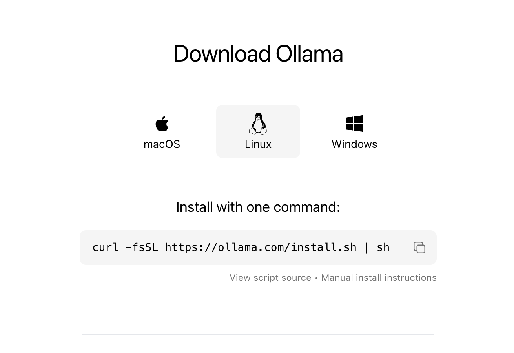
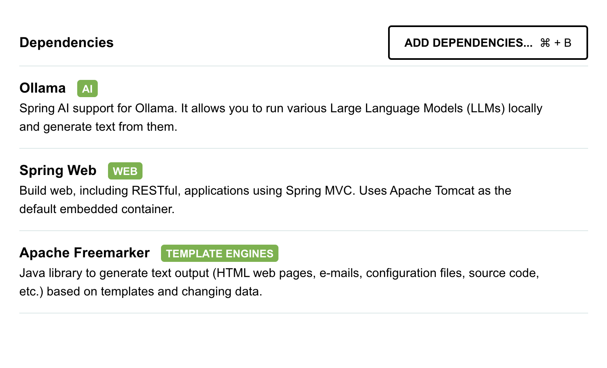
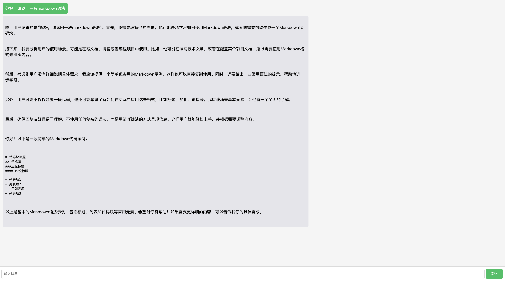

# 私有化部署Deepseek-R1
Deepseek开源了模型，它的强大使得我们可以本地私有化部署，下面我们就受挫一个demo实现。有需要的小伙伴可以拿下来运行实践一下。
 * 使用 Ollama 在本地运行 DeepSeek-R1 并提供 API 服务
 * 使用Spring Boot + Spring AI 实现对 DeepSeek-R1 的调用
 * 在网页上展示调用结果


## 使用 Ollama 运行 deepseek-r1
在Linux服务器上运行Ollama非常简单，只需要两步：
1. 安装 Ollama
```bash
curl -fsSL https://ollama.com/install.sh | sh
```
其他平台请参考[官网](https://ollama.com/download/linux)


2.下载并运行 deepseek-r1 模型
```bash
ollama run deepseek-r1:671b  #最全资源
ollama run deepseek-r1:1.5b
ollama run deepseek-r1:7b
ollama run deepseek-r1:8b
ollama run deepseek-r1:14b
ollama run deepseek-r1:32b
ollama run deepseek-r1:70b
```
根据你的算力资源情况选择其他几个小参数版本。更多信息参考[deepseek-r1](https://ollama.com/library/deepseek-r1)

## 使用Spring Boot + Spring AI
上面步骤完成之后：
1. 使用 https://start.spring.io/ 构建一个Spring Boot项目。搜索Ollama添加依赖以及其他需要的依赖，Spring AI对Ollama的实现支持。

2. 主要AI依赖，可以直接复制添加到现有项目里
```bash
<dependency>
  <groupId>org.springframework.ai</groupId>
  <artifactId>spring-ai-ollama-spring-boot-starter</artifactId>
</dependency>
```
4. 配置Ollama参数
```properties
spring.ai.ollama.base-url=http://localhost:11434
spring.ai.ollama.chat.model=deepseek-r1:1.5b
```
* spring.ai.ollama.base-url: Ollama的API服务地址，如果部署在非本机，就需要做对应的修改
* spring.ai.ollama.chat.model: 要调用的模型名称，对应上一节ollama run命令运行的模型名称
5. service 主要代码，比较简单
```java
@Service
public class ChatServiceImpl implements ChatService {

    @Autowired
    private OllamaChatModel ollamaChatModel;

    @Override
    public String processMessage(String message) {
        // 使用ai发送消息

        return ollamaChatModel.call(message);
    }
}
```
6. 页面测试,数据返回是MarkDown的语法


## 有何不清楚可联系
* e-mail: clay.xu@dvptech.cn
